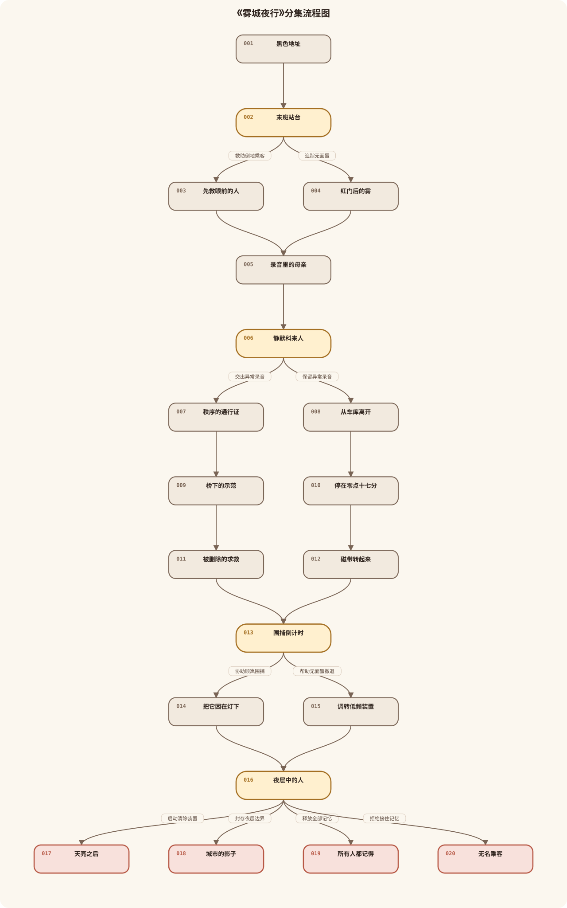
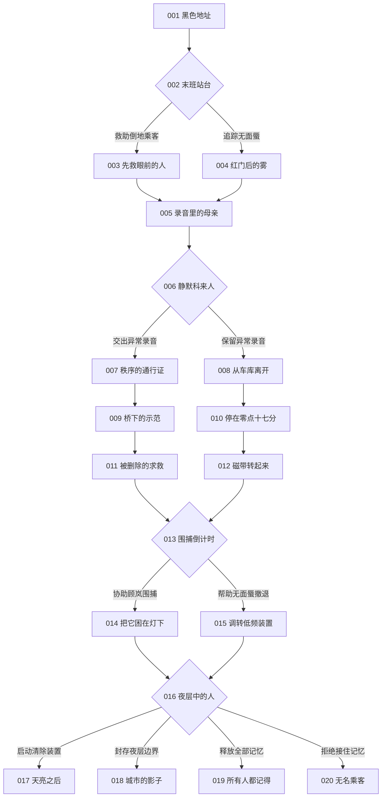

# 《雾城夜行》分集流程与梗概

查看可编辑 Mermaid 源码

## 001《黑色地址》
单集梗概：夜班急救员周野接到来自不存在地址的求救，终端显示午夜地铁的黑色空块；来电中的报站声和延迟倒影把他引向即将停运的站台。

## 002《末班站台》
单集梗概：周野在午夜地铁首次完整看见无面蜃，同时发现一名乘客倒地、怪兽正退向红色检修门，他必须决定先救人还是立即追踪。
- 救助倒地乘客 → 003
- 追踪无面蜃 → 004

## 003《先救眼前的人》
单集梗概：周野完成急救，乘客短暂说出“地下的钟停了”，却随即忘记怪兽；周野获得可核验的声音线索，但失去直接追踪距离。

## 004《红门后的雾》
单集梗概：周野追入检修门，看见无面蜃没有攻击失踪者，反而替一个模糊人影挡住低频震动；他的工作证在倒影中短暂失去姓名。

## 005《录音里的母亲》
单集梗概：两条路线在站台汇合，周野遇见寻找母亲的林柚。她播放母亲留下的录音，报站声与异常来电一致，线索共同指向十年前的地下商业城事故。

## 006《静默科来人》
单集梗概：顾岚封锁急救中心，要求周野交出异常录音并停止调查。周野认出她是旧日救命者，也发现她能准确说出尚未公开的怪兽特征。
- 交出异常录音 → 007
- 保留异常录音 → 008

## 007《秩序的通行证》
单集梗概：周野交出录音后获得顾岚的临时通行与保护。顾岚承认无面蜃会侵蚀现实，却切断异常呼叫，使周野失去独立求救信号。

## 008《从车库离开》
单集梗概：周野保住录音，与林柚从急救中心车库离开。工作证背面的旧钥匙打开地下商业城维修入口，但两人因此被静默科列为阻拦对象。

## 009《桥下的示范》
单集梗概：顾岚带周野到高架桥围捕区，展示低频装置如何压缩无面蜃和异常空间。周野看见装置同时让附近人的一段记忆消失。

## 010《停在零点十七分》
单集梗概：周野与林柚进入地下商业城，中央电子钟停在事故时刻。周野用工作证背面的钥匙打开控制室，发现自己的旧救援编号。

## 011《被删除的求救》
单集梗概：静默科截获的新求救只剩噪声，周野从波形认出林柚母亲的声音。顾岚承认失踪者还活着，却把他们视为无法安全带回的风险。

## 012《磁带转起来》
单集梗概：事故录音机在地下商业城播放，留下实验指令、少年周野的呼吸和顾岚的声音。林柚确认静默政策抽走了幸存者的痛苦，并制造了无面蜃。

## 013《围捕倒计时》
单集梗概：两条路线在高架桥汇合。无面蜃被探照灯和低频装置逼向排水通道，林柚从它的叠声中听见母亲，周野必须决定协助围捕还是帮助它撤退。
- 协助顾岚围捕 → 014
- 帮助无面蜃撤退 → 015

## 014《把它困在灯下》
单集梗概：周野帮助校准装置，无面蜃被困住后没有反击，而是用身体护住通往夜层的雾门。失踪者的声音从它胸腔传出，迫使周野重新理解围捕对象。

## 015《调转低频装置》
单集梗概：周野调转设备为无面蜃打开退路，顾岚公开与他决裂。装置过载露出夜层雾门，林柚母亲的声音要求他们先关闭扩散风险。

## 016《夜层中的人》
单集梗概：周野、林柚和顾岚进入记忆夜层，看见失踪者仍然活着。事故录音补回周野被剥离的记忆，他必须决定清除、共生、公开，或再次拒绝承认。
- 启动清除装置 → 017
- 封存夜层边界 → 018
- 释放全部记忆 → 019
- 拒绝接住记忆 → 020

## 017《天亮之后》
单集梗概：周野启动清除装置，无面蜃、失踪者和事故记忆一起消失。城市恢复秩序，周野回到急救中心，却无法解释工作证背后的空白。

## 018《城市的影子》
单集梗概：周野封存夜层边界，救回愿意离开的失踪者，让无面蜃退入稳定夜层。林柚接受母亲暂时留下，周野成为现实与都市兽之间的引路人。

## 019《所有人都记得》
单集梗概：周野把事故录音接入城市应急系统并释放全部记忆。无面蜃在被承认后消散，失踪者归来，临川市在震荡中开始面对真相。

## 020《无名乘客》
单集梗概：周野拒绝接住自己的事故记忆，工作证彻底空白。他被夜层吸入一列无终点的末班车，现实中的人逐渐忘记他的名字。
