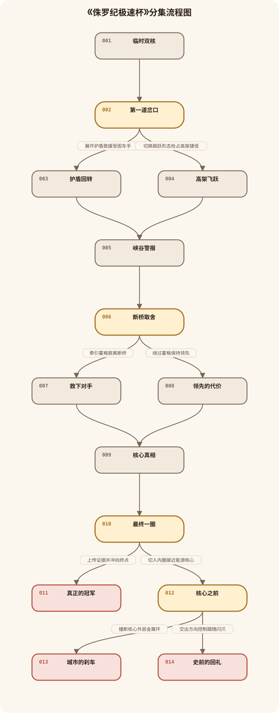
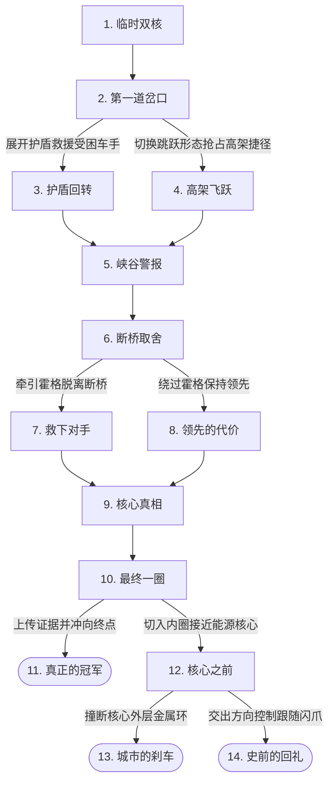

# 《侏罗纪极速杯》分集结构

查看可编辑 Mermaid 源码

## 第1集《临时双核》

单集梗概：总决赛前，临时试驾员洛跃被迫与被禁赛的迅猛龙闪爪共乘双核变形卡丁车；两人争抢控制权时发现赛车正在抽取闪爪的生物能量。

## 第2集《第一道岔口》

单集梗概：机械藤蔓失控，一辆无人显示姓名的参赛车被困在旋转树根旁；安全地面线与高架捷径同时开放，洛跃必须决定先救援还是保住领先。

玩家可见选项：

- 展开护盾救援受困车手 → 第3集
- 切换跳跃形态抢占高架捷径 → 第4集

## 第3集《护盾回转》

单集梗概：洛跃与闪爪展开护盾撞开机械树根，救出受困车手并失去领先；对方留下的车载记录证明赛事在强制抽取恐龙能量。

## 第4集《高架飞跃》

单集梗概：洛跃选择跳跃形态抢上高架，保住领先却错过救援；落地冲击让隐藏能量线路暴露，闪爪因此质疑洛跃是否也只把他当夺冠工具。

## 第5集《峡谷警报》

单集梗概：两条路线在熔岩峡谷汇合：救援路线带来车载记录，捷径路线带来隐藏接口数据。洛跃用领航终端确认两类证据都指向霍格控制的时空能源核心。

## 第6集《断桥取舍》

单集梗概：霍格的赛车被过载磁轨卡在断桥边，赛事却仍未暂停；洛跃必须决定冒险牵引对手，还是绕过他保持领先并保存赛车能量。

玩家可见选项：

- 牵引霍格脱离断桥 → 第7集
- 绕过霍格保持领先 → 第8集

## 第7集《救下对手》

单集梗概：洛跃和闪爪耗尽护盾牵引霍格脱困。霍格趁近距离删除失败后露出核心控制界面，闪爪则因洛跃愿意承担代价而真正交出一半控制权。

## 第8集《领先的代价》

单集梗概：洛跃绕过霍格抢上升降磁轨，却遭霍格远程锁车。闪爪用能量感知引导洛跃切断隐藏线路，两人保住证据，也不得不直面未救对手的选择后果。

## 第9集《核心真相》

单集梗概：进入时空核心环道后，洛跃将能量记录、远程授权与闪爪的感知叠合，确认霍格正用全场竞速启动时空引擎；继续加速将把城市拖入裂缝。

## 第10集《最终一圈》

单集梗概：最终一圈，公开证据并尽快冲线可以让竞速输入停止、争取冠军；切入内圈则会立刻放弃名次，直接面对过载核心。

玩家可见选项：

- 上传证据并冲向终点 → 第11集
- 切入内圈接近能源核心 → 第12集

## 第11集《真正的冠军》

单集梗概：洛跃与闪爪边上传证据边冲刺，利用双座协同挡住霍格并率先冲线；比赛结束使全场减速，核心停止继续充能，阴谋公开、生态区获保留。

本集为正式结局。

## 第12集《核心之前》

单集梗概：双核赛车切入内圈，霍格封锁维护平台。闪爪提出两种方案：撞断外环强制停机，或由他感知裂缝并穿越核心带走过载能量。

玩家可见选项：

- 撞断核心外层金属环 → 第13集
- 交出方向控制跟随闪爪 → 第14集

## 第13集《城市的刹车》

单集梗概：洛跃与闪爪选择强制撞断核心外环，以双核赛车和冠军为代价让引擎停机；城市获救，两人成为让整场赛事踩下刹车的英雄。

本集为正式结局。

## 第14集《史前的回礼》

单集梗概：洛跃完全交出方向控制，闪爪凭能量感知带车穿过裂缝，将过载能量释放到无人的史前天空；两人返回时带回能修复生态区的古老植物。

本集为正式结局。
