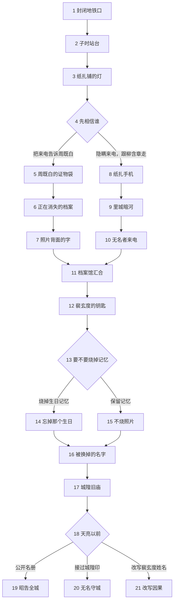

# 《夜行无名》分集结构

## 第1集《封闭地铁口》

单集梗概：暴雨夜，民俗记者沈砚在旧城区拍摄待拆建筑时接到失踪七年的姐姐沈青梧来电；循着电话里的铃声，他在封闭地铁口发现一具腕缠红线的男尸，并在遗体被抬走时仿佛听见死者说“青梧在下面的站台”，于是子时独自返回地铁口。

默认进入：第2集。

## 第2集《子时站台》

单集梗概：沈砚进入只在子时显现的废站，在不开门的旧列车里看见沈青梧；他追着车窗求姐姐回来，沈青梧却只能指向一块突然亮起的出口牌。

默认进入：第3集。

## 第3集《纸扎铺的灯》

单集梗概：出口把沈砚送回旧城区的纸扎铺，柳含章认出沈青梧的铃声并说她已不在现实户籍中；与此同时，周既白来电要求沈砚补充现场笔录。

默认进入：第4集。

## 第4集《先相信谁》

单集梗概：柳含章要沈砚隐瞒姐姐来电并跟她进入里城，周既白则说警方保存的一段红线正在从证物记录中消失；沈砚必须决定先把真相交给谁。

你怎么做？

- 把姐姐来电告诉周既白 → 第5集
- 隐瞒来电，跟柳含章走 → 第8集

## 第5集《周既白的证物袋》

单集梗概：沈砚向周既白坦白姐姐来电与死者声音，周既白没有相信超自然解释，却拿出一只标签文字正在褪去的证物袋，并带沈砚去查死者留下的纸质档案。

默认进入：第6集。

## 第6集《正在消失的档案》

单集梗概：两人在民俗档案馆发现死者的电子记录已经消失，纸质登记上的姓名也在变淡；周既白亲眼看见自己保存的笔迹被抹去，第一次承认案件不能只按人为伪造解释。

默认进入：第7集。

## 第7集《照片背面的字》

单集梗概：沈砚在沈青梧的旧资料盒中找到姐弟合影，照片背面写着“原名沈砚”；周既白从档案借阅记录中查到裴玄度，二人循线前往馆内保险柜。

默认进入：第11集。

## 第8集《纸扎手机》

单集梗概：沈砚隐瞒来电后，柳含章从柜底取出一截保存多年的红线，把它缠进一部纸扎手机并当面交给他；手机传出子时站台的报站声，证明柳含章确实能联通里城。

默认进入：第9集。

## 第9集《里城暗河》

单集梗概：柳含章带沈砚从纸扎铺后门进入暗河，河岸上的无名者都缠着同样的红线；沈砚看见一名无名者的脸正在从旧照片中消失，明白尸案与除名相连。

默认进入：第10集。

## 第10集《无名者来电》

单集梗概：纸扎手机接通沈青梧，她承认自己参与过七年前的仪式，却请求沈砚在天亮前找到档案馆里的名册；沈砚因再次被姐姐隐瞒而愤怒，仍决定去取回能证明她存在的纸证。

默认进入：第11集。

## 第11集《档案馆汇合》

单集梗概：沈砚带着不同路线取得的证据来到档案馆保险柜，周既白或柳含章分别补足现实记录与里城规则；两条线索共同证明沈青梧的资料被人有意转移。

默认进入：第12集。

## 第12集《裴玄度的钥匙》

单集梗概：城市历史顾问裴玄度现身，用钥匙打开保险柜并展示缺页名册；他承认献祭存在，却把牺牲少数人解释为守住全城的必要成本，并诱导沈砚接替姐姐。

默认进入：第13集。

## 第13集《要不要烧掉记忆》

单集梗概：裴玄度质疑亡者遗言可能被篡改，柳含章指出沈砚可用禁术辨认真伪，但必须烧掉一段真实记忆；沈砚面对与姐姐有关的旧合影决定是否付出代价。

你怎么做？

- 烧掉童年生日记忆，辨认遗言 → 第14集
- 保留记忆，只查纸面证据 → 第15集

## 第14集《忘掉那个生日》

单集梗概：沈砚燃烧与姐姐共度生日的记忆，确认死者所说的站台位置没有被篡改；代价兑现后，他看着合影却再也想不起蛋糕和姐姐当晚的声音。

默认进入：第16集。

## 第15集《不烧照片》

单集梗概：沈砚拒绝拿姐姐的记忆验证一句遗言，转而从纸质借阅单、合影背字和名册缺页拼出姓名替换过程；证据不如禁术直接，却保住了姐弟共同记忆。

默认进入：第16集。

## 第16集《被换掉的名字》

单集梗概：沈青梧通过纸扎手机承认沈砚才是七年前的原定祭品，她偷换姓名救下弟弟并把自己送进里城；沈砚发现姐姐既是救命恩人也是剥夺他选择的共犯，带着不同记忆状态赶往旧庙。

默认进入：第17集。

## 第17集《城隍旧庙》

单集梗概：沈砚在旧庙终于与沈青梧面对面，裴玄度却启动城隍印，要用新一批无名者维持城市；周既白与柳含章依据此前的信任路线分别用纸证或无名者声音松开红线，帮助沈砚夺回完整名册。

默认进入：第18集。

## 第18集《天亮以前》

单集梗概：城隍印裂开，里城灾厄开始倒灌现实；沈青梧要求沈砚自己决定代价，沈砚必须在公开真相、替姐姐守城和改写裴玄度姓名之间作出最终选择。

你怎么做？

- 公开名册，叫醒全城 → 第19集
- 接过城隍印，替姐姐守城 → 第20集
- 把裴玄度写进名册 → 第21集

## 第19集《昭告全城》

单集梗概：沈砚公开名册与纸证，全城逐渐记起被献祭者，沈青梧恢复姓名；与此同时，积压灾厄重返现实，姐弟在黎明中选择共同承担一个不再靠遗忘维持的城市。

结局：昭告全城。

## 第20集《无名守城》

单集梗概：沈砚接过城隍印替代姐姐，沈青梧回到现实，他却从证件、照片和姐姐记忆中逐渐消失；最后一次通话中，他叫姐姐回家，而沈青梧已经不知道电话那头是谁。

结局：无名守城。

## 第21集《改写因果》

单集梗概：沈砚利用名册夹层中的真实姓名和破裂城隍印，把长期逃避死亡的裴玄度写入里城；献祭暂时停止，姐弟带着未解灾厄离开旧庙，并决定公开建立新的记名规则。

结局：改写因果。
