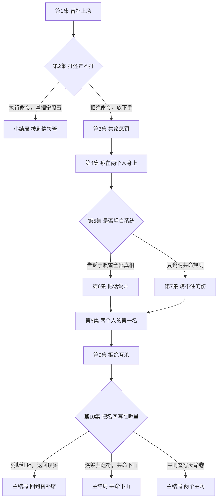
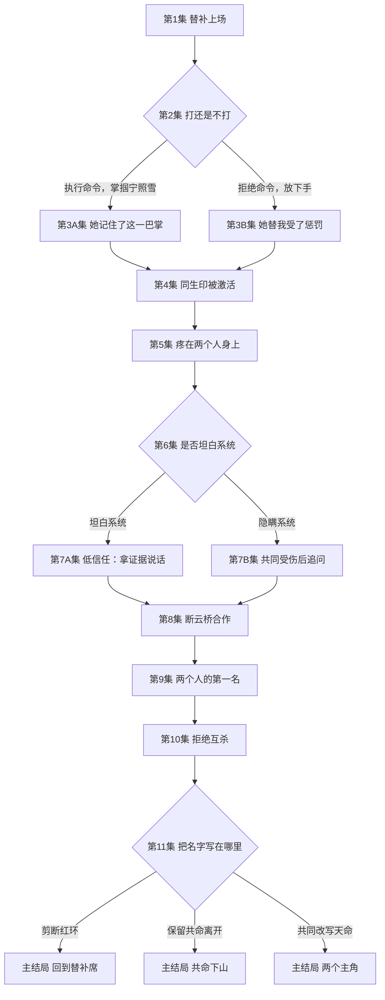
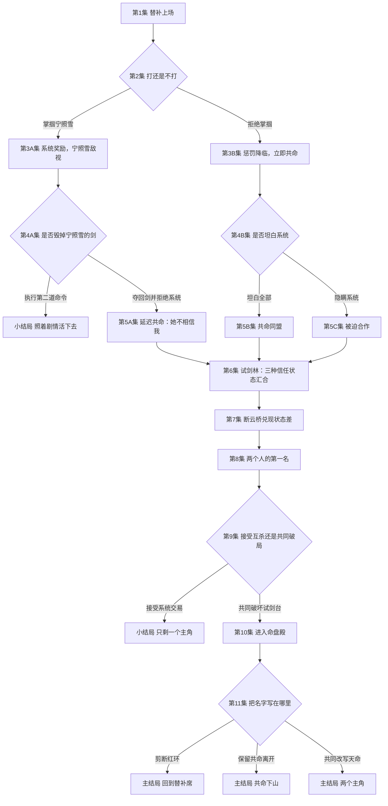

# 《我和女主共用一条命》三种分支拓扑方案

以下三案使用同一人物、世界和终局，只改变第二集“打／不打”被识别后如何展开。

## 方案一：教学死路型

不改变“拒绝掌掴才触发共命”的既有规则。第一处选择直接告诉玩家：服从系统虽然暂时安全，却会失去后续行动权。

结构特点：改动最小；第一选择有明确生死压力；“打”线只有一个结果节点，复玩内容较少。

## 方案二：带差异快速汇合型

把共命红环调整为入门台隐藏的同生印：第一次身体接触或共同承受阵法判定都会激活。系统只决定激活方式，不决定红环是否存在。两条路线都进入主线，但带着不同关系与系统状态汇合。

结构特点：两项选择都能继续；汇合快、制作量可控；需要调整共命装置的触发规则，并在后续持续承接“打过她／替她反抗”的关系差异。

## 方案三：多级编织带型

保留“第一次拒绝系统才触发共命”。玩家若先选择掌掴，系统会在下一阶段提出更严重的命令；玩家仍有机会反抗并进入共命主线，也可能继续服从而走向小结局。

结构特点：最完整地兑现“服从／反抗”主题；第一次选择不会被浪费，后续还能形成二次反讽；节点和剧本制作量最高，汇合节点必须真实承接三种信任状态。

