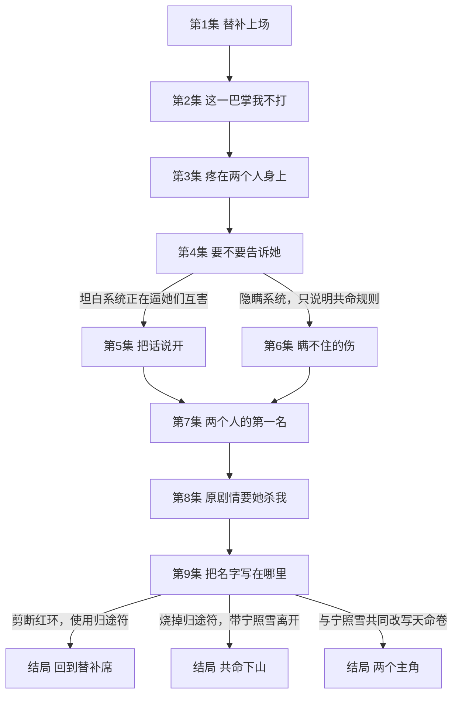

# 《我和女主共用一条命》分集流程

## 第1集《替补上场》
现实中的电竞替补苏澄又一次被通知不能上场，停电后却穿进仙侠剧情，成为即将在入门礼上羞辱女主的恶毒大师姐。

## 第2集《这一巴掌我不打》
系统命令苏澄掌掴新弟子宁照雪；苏澄当众拒绝后，两人同时倒地，腕上出现相同的红环。

## 第3集《疼在两个人身上》
白婆婆用针刺和距离测试确认两人共享伤势；魏无尘仍命令她们参加当日试剑大会，苏澄必须先决定是否把系统的存在告诉宁照雪。

## 第4集《要不要告诉她》
苏澄知道系统正在推动宁照雪杀死自己，而宁照雪只知道两人共命；试剑林开门前，苏澄必须决定坦白多少。

- 坦白系统正在逼她们互害 → 第5集
- 隐瞒系统，只说明共命规则 → 第6集

## 第5集《把话说开》
苏澄告诉宁照雪原剧情和系统任务；宁照雪用一次小伤验证她没有撒谎，两人约定先一起通过试炼，再决定是否继续相信对方。

## 第6集《瞒不住的伤》
苏澄只告诉宁照雪共命规则，宁照雪拒绝听她安排；机关木鸟袭击时，苏澄为避免同步重伤扑倒宁照雪，被迫承认自己早知道危险。

## 第7集《两个人的第一名》
两条路线在断云桥汇合；两人带着不同信任状态共同跨过断桥、取下两枚试炼令，并以同步动作第一次拔动同生剑。

## 第8集《原剧情要她杀我》
魏无尘封锁试剑台，要求宁照雪用同生剑杀掉苏澄完成认主；系统同时承诺苏澄按原剧情死亡即可返回现实，两人拒绝互杀并闯入命盘殿。

## 第9集《把名字写在哪里》
命盘殿中，系统把切断共命、返回现实和共同改写天命的代价全部摆到两人面前；苏澄必须决定把自己、宁照雪和这段关系留在哪里。

- 剪断红环，使用归途符 → 第10集
- 烧掉归途符，带宁照雪离开 → 第11集
- 与宁照雪共同改写天命卷 → 第12集

## 第10集《回到替补席》
苏澄剪断红环并返回现实，终于获得上场机会，却完全忘记宁照雪，只在腕上留下一圈无法解释的红痕。

## 第11集《共命下山》
苏澄烧毁归途符，与宁照雪保留共命离开凌霄宗；两人必须继续承受共享伤痛，却第一次可以自己选择下一站。

## 第12集《两个主角》
苏澄和宁照雪共同在天命卷主角位签名，系统单主角规则崩溃；她们留在世界中重开试剑大会，让所有弟子自己决定是否上场。
