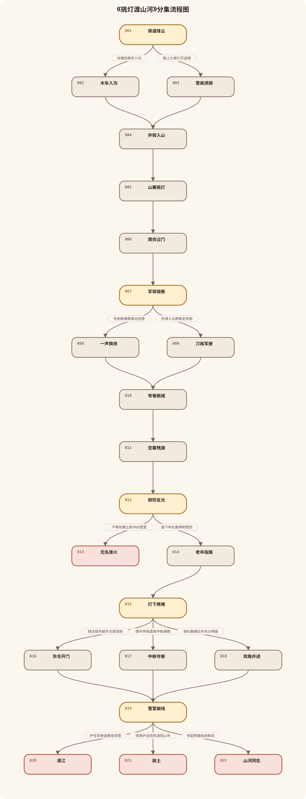
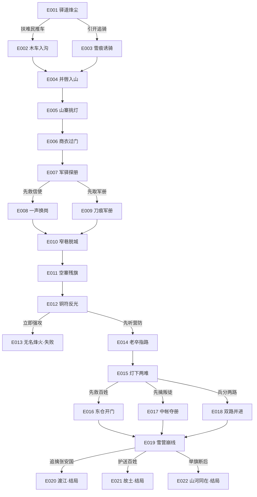

# 《挑灯渡山河》分集结构

查看可编辑 Mermaid 源码

## 第1集《驿道烽尘》

单集梗概：金军追骑逼近破驿亭，沈砚在逃命与救助受困难民之间作出第一次行动选择，青年辛弃疾率骑赶到接应。

玩家选择：

- 扶难民推车入沟 → 第2集
- 踏上土坡引开追骑 → 第3集

## 第2集《木车入沟》

单集梗概：沈砚与难民合力把木车推入干沟，辛弃疾在土坡上压住追骑，为众人争出撤离时间。

## 第3集《雪痕诱骑》

单集梗概：沈砚利用风向和雪痕把追骑引向枯林，辛弃疾趁机护送难民进入干沟，却也看见沈砚不肯舍人的本性。

## 第4集《并辔入山》

单集梗概：两路在枯林后汇合，辛弃疾说明军册危机并邀请沈砚同行；沈砚从流民口中得知沈棠可能被带往济南。

## 第5集《山寨挑灯》

单集梗概：沈砚进入山谷营寨，认识老卒杜衡；众人在残旗与油灯下制定潜城计划，张安国旧部的异常调动留下疑点。

## 第6集《商衣过门》

单集梗概：沈砚与辛弃疾伪装成商旅进入济南，在军驿外确认岗哨、水缸、北房与后巷路线。

## 第7集《军驿探册》

单集梗概：两人潜入军驿后同时发现北房里的军册和被绑在值守房后的义军信使，有限时间迫使沈砚决定先做哪件事。

玩家选择：

- 先割断绳索救出信使 → 第8集
- 先潜入北房取走军册 → 第9集

## 第8集《一声换岗》

单集梗概：沈砚先救信使并取得换岗口令；虽被延误，三人仍借口令截住文吏、夺得军册并退入后巷。

## 第9集《刀痕军册》

单集梗概：沈砚先取出带朱印与刀痕的军册；信使借断栏铁钉自行磨断腕绳，三人在更早响起的警报中退入后巷。

## 第10集《窄巷脱城》

单集梗概：沈砚带着军册，和辛弃疾、伤腿信使穿过后巷，在追兵压力下抵达排水沟，由杜衡接应逃出济南。

## 第11集《空寨残旗》

单集梗概：众人回到被焚毁的营寨，发现首领遇害。张安国假借铜符验册，突然发难夺走军册，并透露沈棠与百姓被押在雪营。

## 第12集《铜符反光》

单集梗概：杜衡从雪地铜符痕迹判断张安国的去向，沈砚却听见军册即将送交金军；他必须决定立即强攻还是先完成侦察。

玩家选择：

- 不等侦察立即冲向雪营 → 第13集
- 留下听杜衡辨明营防 → 第14集

## 第13集《无名烽火》

单集梗概：沈砚未侦察便撞上北坡瞭望哨，张安国点燃烽火把军册送往金军方向；义军突袭失败，众人的名字淹没在雪夜里。

## 第14集《老卒指路》

单集梗概：杜衡在残旗旁复原雪营布局，沈砚从旧平安结和流民留下的药布确认沈棠就在东仓；袍泽信任形成分兵条件。

## 第15集《灯下两难》

单集梗概：三人在雪营外最后校对火盆、换岗和撤离路线。东仓百姓、中帐军册与张安国无法同时先取，沈砚作出核心路线选择。

玩家选择：

- 随沈砚先破东仓救百姓 → 第16集
- 随辛弃疾直取中帐擒叛 → 第17集
- 请杜衡接应并兵分两路 → 第18集

## 第16集《东仓开门》

单集梗概：沈砚先潜入东仓，与沈棠重逢并组织百姓撤离；张安国奔逃时被燃梁惊马，军册落地并由辛弃疾收回。

## 第17集《中帐夺册》

单集梗概：沈砚与辛弃疾直取中帐，夺回边缘染焦的军册并逼退张安国；东仓警钟响起，百姓的撤离尚未展开。

## 第18集《双路并进》

单集梗概：杜衡接受分兵，接应沈棠组织百姓；沈砚与辛弃疾突入中帐，沈砚为维持两路信号负伤，军册和救援同时推进。

## 第19集《雪营崩线》

单集梗概：三路在西侧马厩与主通道交汇，张安国借火势逃向浅滩，慢行百姓也将被追骑截断。沈砚必须决定最后把自己放在哪一边。

玩家选择：

- 护住军册追擒张安国 → 第20集
- 转身护送百姓退回山东 → 第21集
- 举起残旗独自断后 → 第22集

## 第20集《渡江》

单集梗概：沈砚与辛弃疾擒获张安国、封存军册并率残部渡江，代价是部分掉队百姓未能赶上木舟；二人把未酬壮志带往南岸。

## 第21集《故土》

单集梗概：沈砚放弃追擒，护送沈棠和百姓回到山东隐蔽村落；他与辛弃疾隔江告别，重新竖起残旗并重建联络。

## 第22集《山河同在》

单集梗概：沈砚举旗断后，以负伤换来杜衡完成分兵、辛弃疾擒叛和沈棠带百姓撤离；渡口上，众人以共同誓言决定让火种两岸同燃。
