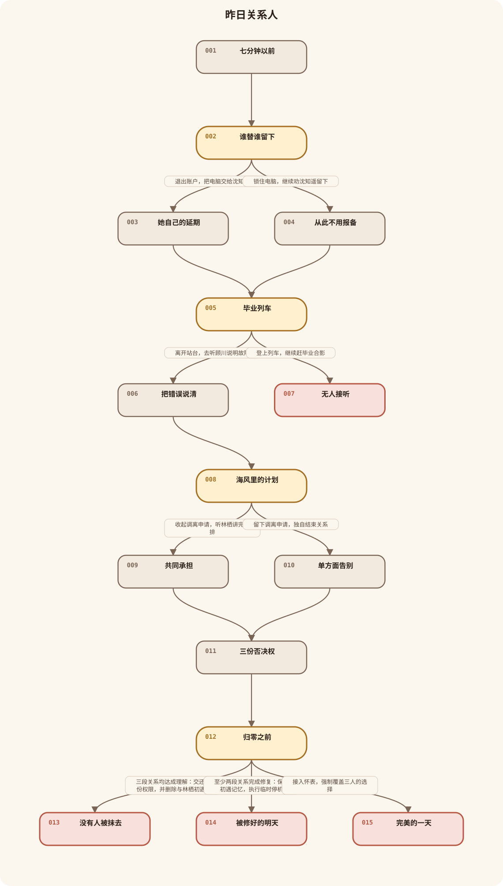
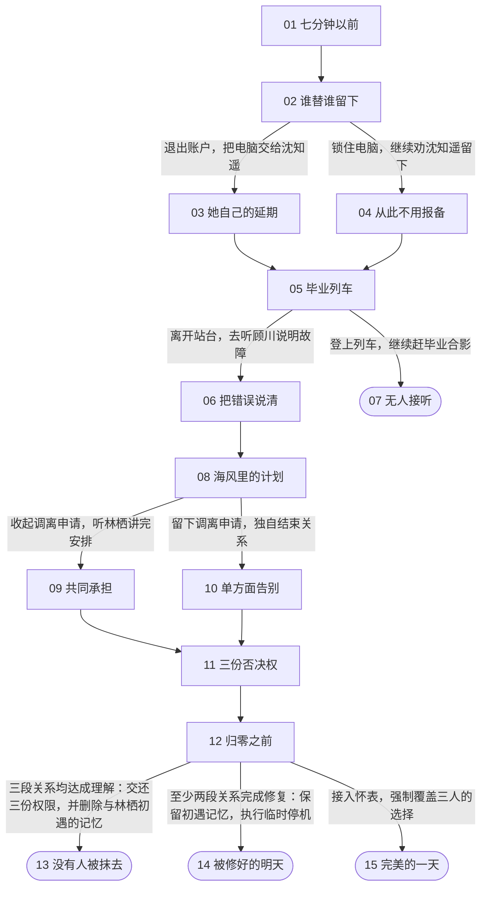

# 《昨日关系人》v0.1.19 独立分集结构

查看 Mermaid 源码

## 第1集《七分钟以前》

研究所观测员沈砚在值班时按掉妹妹来电，随即看见月亮重复升起；设备事故让旧怀表显示出七分钟倒计时，并把他送回兄妹决裂之夜。

## 第2集《谁替谁留下》

沈砚回到自己代妹妹拒绝外地项目的雨夜；沈知遥要求他交还选择权，玩家决定承认越界，还是继续以安全为由把她留下。

选择问题：面对被自己代为拒绝的项目，沈砚现在先做什么？

- 退出账户，把电脑交给沈知遥 → 第3集
- 锁住电脑，继续劝沈知遥留下 → 第4集

## 第3集《她自己的延期》

沈砚退出账户并承认自己害怕独自留下；沈知遥没有按他期待的方式离开，而是自行申请延期，并给哥哥设下新的相处边界。

## 第4集《从此不用报备》

沈砚仍然锁住电脑，试图用风险说服妹妹留下；沈知遥放弃当晚申请，随后退出家庭共享，现实中的兄妹关系变得更加正式和遥远。

## 第5集《毕业列车》

现实新增的街道指向跨江地铁站，沈砚在那里被怀表送回毕业日；顾川请求他协助处理失控模型，而毕业列车同时进站。

选择问题：顾川请他去检修门后帮忙时，沈砚怎么回应？

- 离开站台，去听顾川说明故障 → 第6集
- 登上列车，继续赶毕业合影 → 第7集

## 第6集《把错误说清》

沈砚走进检修区陪顾川关闭模型，并拒绝替他承担错误；顾川亲自向研究所报告问题，两人的合作关系因此重新保留下来。

## 第7集《无人接听》

沈砚仍登上毕业列车，顾川独自处理模型失败；两次被忽视的求助使关系锚点不足，零点重置在列车中提前启动。

## 第8集《海风里的计划》

顾川带沈砚查到海岸观测塔的人工记录，怀表将沈砚送回与林栖分手的清晨；林栖要求他停止用“怕拖累”替她决定未来。

选择问题：林栖说明自己要去海站后，沈砚如何处理两人的未来？

- 收起调离申请，听林栖讲完安排 → 第9集
- 留下调离申请，独自结束关系 → 第10集

## 第9集《共同承担》

沈砚收回替林栖准备的调离申请，听她说明海站计划和月升异常；两人没有恢复理想关系，却约定今后先告知风险，再共同决定。

## 第10集《单方面告别》

沈砚仍把调离申请留给林栖，试图用退出关系保护她；林栖保留公共观测日志，却明确拒绝再让沈砚参与自己的私人选择。

## 第11集《三份否决权》

沈砚、顾川和林栖进入研究所，沈知遥携城市安全协议赶到；贺兰舟揭示三人的成果不是启动钥匙，而是零点重置原本必须取得的三份本人授权。

## 第12集《归零之前》

三位密钥持有人在观测塔分别控制自己的成果，贺兰舟说明关闭代价；玩家决定交还权限并牺牲初遇记忆、暂时停机，或强制覆盖他人的选择。

选择问题：三位密钥持有人已经到场，沈砚最后采用哪种关闭方式？

- 三段关系均达成理解：交还三份权限，并删除与林栖初遇的记忆 → 第13集
- 至少两段关系完成修复：保留初遇记忆，执行临时停机 → 第14集
- 接入怀表，强制覆盖三人的选择 → 第15集

## 第13集《没有人被抹去》

沈砚只承担自己的记忆代价，三位密钥持有人分别确认关闭；时间通道永久封闭，世界稳定，而沈砚醒来后已不认识林栖。

## 第14集《被修好的明天》

沈砚保留初遇记忆，众人共同执行九十天临时停机；城市脱离当晚危机，但异常仍在，他们必须在关系未必圆满的情况下继续合作。

## 第15集《完美的一天》

沈砚接入强制端口，把三段关系改写成永不拒绝自己的理想状态；城市恢复得毫无裂缝，却被锁进所有人重复说“愿意”的同一天。
