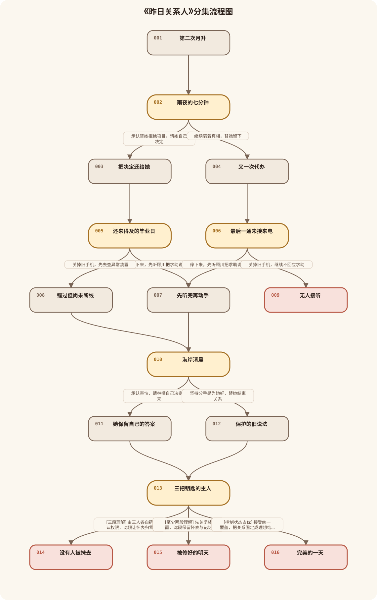
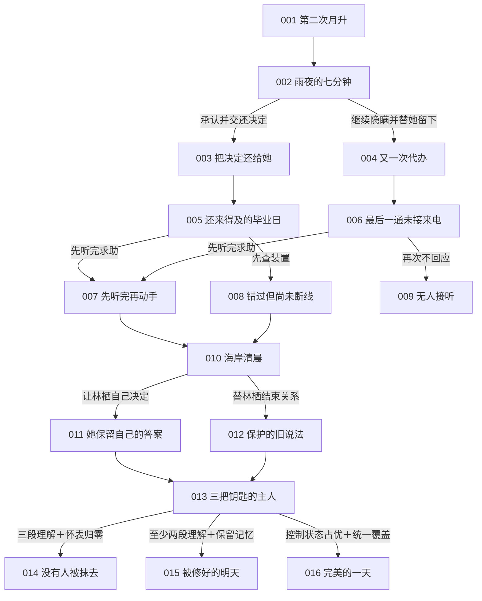

# 《昨日关系人》分集结构

> 本结构只使用 v0.1.21 冻结后的上游整理稿重新生成，没有读取或复用旧版拓扑与剧本。原企划的 12 个关键剧情段落被拆为 16 个可执行节点，拆出的部分只负责分别演出选项即时结果，不新增人物、地点、道具、规则或支线。

查看可编辑 Mermaid 源码

## 一眼看懂主线

沈砚不是靠“关系变好”给装置充能，而是在三次过去里决定自己是否还要替别人作主。这个选择会改变沈知遥、顾川、林栖是否愿意保存各自的协议、模型和日志，并在今天接他的电话、亲自来到海岸观测塔。三人到场后各自操作自己的成果；沈砚最后只决定一件属于自己的事：是否让怀表归零，失去与林栖初遇的记忆。

## episode-001｜第二次月升

### 单集梗概

2037 年深夜，沈砚在时序研究所主控厅核对城市时间偏差。沈知遥来电，他看着屏幕没有接；下一刻，监测窗外已经落下的月亮从海面第二次升起。主控系统把异常归为仪器误差，贺兰舟却命人提前准备零点重置。沈砚先用普通观测数据确认月升确实重复，随后发现外套里的裂纹怀表逆向走动，表盖内侧依次闪过旧公寓、地铁站和海岸观测塔的时间刻度。第一集结束于他按下表冠，被送进与妹妹决裂的雨夜。

- 前置节点：无
- 后续节点：episode-002
- 玩家可见选择：无
- 本集结果：建立妹妹来电、第二次月升、零点重置倒计时和怀表的三个固定断点；沈砚的下一步是先查清妹妹那一夜发生了什么。

## episode-002｜雨夜的七分钟

### 单集梗概

沈砚回到多年前的沈家旧公寓。沈知遥背着电脑包站在门边，刚发现外地项目被人以她的名义拒绝；她没有泛泛争吵，而是把拒绝页面摆到沈砚面前，只问是不是他做的。怀表开始倒计时，沈砚必须选择：承认自己替她拒绝项目，把接下来去不去的决定还给她；或者继续隐瞒，利用剩下七分钟替她安排留在澜城的工作。

- 前置节点：episode-001
- 后续节点：episode-003, episode-004
- 选择问题：沈砚如何回应沈知遥眼前的质问？
- 选项 A：承认替她拒绝项目，请她自己决定。
- 选项 B：继续瞒着真相，替她留下。

## episode-003｜把决定还给她

### 单集梗概

沈砚承认拒绝项目的人就是自己，也承认“怕她吃亏”不能替代她的同意。沈知遥没有立刻原谅，只要求他退出房间，让她自己给项目方回电；她带走电脑包和仍由自己控制的分布式安全协议。七分钟结束，沈砚回到主控厅，旧手机上多出沈知遥刚发来的短讯：她只答应核对一份城市系统异常，不答应听他安排。与此同时，旧手机里的兄妹头像重新清晰，主控屏上的城市断电区却扩大一格。

- 前置节点：episode-002
- 后续节点：episode-005
- 玩家可见选择：无
- 本集结果：兄妹关系进入“警惕但可回应”，沈知遥保留协议与本人决定权；现实反馈证明过去已改变，但危机没有自动消失。

## episode-004｜又一次代办

### 单集梗概

沈砚否认自己动过项目，转身替沈知遥联系澜城的岗位，试图把“留下更安全”做成既定事实。沈知遥从他的停顿和已经准备好的资料里确认真相，夺回电脑包，明确要求他以后不要再替她接任何电话。七分钟结束，沈砚回到主控厅；旧手机里沈知遥的联系人只剩一串号码，原本的兄妹头像也变成空白，城市断电区同样扩大。沈砚仍可继续穿越，但已经累积一次“不回应对方明确请求”的状态。

- 前置节点：episode-002
- 后续节点：episode-006
- 玩家可见选择：无
- 本集结果：兄妹关系进入“再次被控制”，沈知遥保留协议但拒绝回应沈砚；失败条件累计一次。

## episode-005｜还来得及的毕业日

### 单集梗概

在沈知遥仍愿意回应的时间线上，怀表把沈砚送到毕业日的澜城跨江地铁站。顾川追上正准备进站的沈砚，把折叠终端递到他面前，请他先别走，听完模型发现的异常；远处列车即将进站，怀表也只剩几分钟。沈砚可以停下，先听顾川把求助说完；也可以关掉响起的旧手机，认定装置比朋友更紧急，先去查异常源。

- 前置节点：episode-003
- 后续节点：episode-007, episode-008
- 选择问题：面对顾川的求助，沈砚先回应人，还是先追装置？
- 选项 A：停下来，先听顾川把求助说完。
- 选项 B：关掉旧手机，先去查异常装置。

## episode-006｜最后一通未接来电

### 单集梗概

在沈知遥已经拒绝回应的时间线上，沈砚来到同一个毕业日地铁站。顾川把终端递过来，请他先听完；旧手机同时亮起沈知遥那通尚未得到回应的来电记录。玩家此刻清楚知道，再次关掉求助会构成连续两次不回应。沈砚仍可以停下听顾川，打断失败累积；也可以继续把人放在任务之后，使零点重置提前启动。

- 前置节点：episode-004
- 后续节点：episode-007, episode-009
- 选择问题：沈砚是否在第二次求助前停下来？
- 选项 A：停下来，先听顾川把求助说完。
- 选项 B：关掉旧手机，继续不回应求助。

## episode-007｜先听完再动手

### 单集梗概

沈砚没有抢顾川的终端，只让他从头说。顾川说明模型发现研究所的重置程序会把“失败时间线”直接删除，而创造者本人仍能否决自己的模型被这样使用；他要的不是沈砚替他提交证据，而是确认沈砚愿不愿一起承担公开证据的后果。沈砚答应先听后行动，顾川保存模型副本。返回现在后，跨江地铁列车在同一分钟进站两次，毕业三人合照里的顾川却从模糊恢复清晰；旧手机出现顾川发来的模型校验结果。

- 前置节点：episode-005, episode-006
- 后续节点：episode-010
- 玩家可见选择：无
- 本集结果：顾川进入“愿意合作但要亲自决定用途”的状态，预测模型与本人授权保留。

## episode-008｜错过但尚未断线

### 单集梗概

沈砚关掉手机，越过顾川去追列车上的异常信号。顾川没有追着解释，而是收回终端，留下“你还是只在乎能不能解决”的判断。返回现在后，列车同样重复进站，毕业三人合照里的顾川变得模糊，旧手机中却还保留沈知遥发来的系统异常资料。因为此前沈砚已经回应过妹妹，关系锚点尚未跌破底线，他仍能进入第三个断点，但顾川不会主动带模型来帮他。

- 前置节点：episode-005
- 后续节点：episode-010
- 玩家可见选择：无
- 本集结果：顾川进入“不信任且不主动到场”的状态；一段关系仍在理解状态，因此主线继续。

## episode-009｜无人接听

### 单集梗概

沈砚第二次关掉求助，旧手机上的两条未接记录同时消失。地铁广播开始倒放，刚进站的列车空无一人；他回到现在时，主控厅所有通讯频道只剩无法接通的忙音。没有任何一位关系对象回应他的求助，贺兰舟不再等待三组授权，直接启动零点重置。城市灯光按街区依次熄灭，沈砚拨出电话，却只能听见自己当年留下的两次忙音。

- 前置节点：episode-006
- 后续节点：无
- 是否结局：是，失败小结局《无人接听》
- 本集结果：连续忽视两次求助导致关系锚点不足，零点重置提前启动。

## episode-010｜海岸清晨

### 单集梗概

沈砚进入最后一个断点：多年前的海岸观测塔清晨。林栖正把重复月升的人工日志装进资料盒，准备和他讨论两人的未来；沈砚却已经收拾好离开的东西。林栖看见他的动作后先问清楚：他是想结束关系，还是又想替她决定什么对她更好。沈砚可以承认自己害怕拖累她，请她自己决定要不要留下；也可以坚持分手是保护，替两人把关系结束。

- 前置节点：episode-007, episode-008
- 后续节点：episode-011, episode-012
- 选择问题：沈砚把两人的未来交还给林栖，还是继续替她作主？
- 选项 A：承认害怕，请林栖自己决定未来。
- 选项 B：坚持分手是为她好，替她结束关系。

## episode-011｜她保留自己的答案

### 单集梗概

沈砚承认离开是因为自己害怕，而不是林栖承受不起。林栖没有许诺永远留下，她选择先保存人工日志、继续自己的观测，并要求两人之后共同面对是否继续关系。七分钟结束，沈砚回到现在的海岸观测塔；月亮仍在重复升起，但资料柜里出现林栖亲手保存的未篡改日志，她本人也已经到场。她只同意用日志校准现实，不同意沈砚替她决定最终牺牲。

- 前置节点：episode-010
- 后续节点：episode-013
- 玩家可见选择：无
- 本集结果：林栖保留日志、本人授权和未来选择；爱情关系进入理解状态。

## episode-012｜保护的旧说法

### 单集梗概

沈砚仍把离开说成“为你好”，并把已经决定的分手通知林栖。林栖先确认他不准备听答案，随后收起日志，明确两件事：记录属于她，关系也不能由他一个人包装成牺牲。返回现在后，海岸观测塔的资料柜只剩空槽，毕业三人合照里的林栖转身看向画外；她仍可能为阻止贺兰舟提供证据，却不会把私人记忆或未来交给沈砚处置。

- 前置节点：episode-010
- 后续节点：episode-013
- 玩家可见选择：无
- 本集结果：林栖保持独立但拒绝关系修复，人工日志是否参与取决于终局的既有关系状态与她本人的判断。

## episode-013｜三把钥匙的主人

### 单集梗概

现在时的海岸观测塔与时序研究所主控厅同步进入零点倒计时。贺兰舟公开人格密钥的真正用途：她调用了沈知遥的协议、顾川的模型和林栖的日志，却要删除这些创造者之间不可预测的关系，令系统只服从单一时间线。沈砚没有“收集钥匙”；旧手机上三人的实际回复、到场情况和手中成果共同证明此前选择。愿意合作的人各自说明自己能做什么、承担什么，不愿合作的人也明确拒绝被代替。系统据此开放符合当前状态的终局行动。

- 前置节点：episode-011, episode-012
- 后续节点：episode-014, episode-015, episode-016
- 选择问题：在当前关系状态下，沈砚承担哪一种结果？
- 选项 A（仅三段理解时开放）：由三人各自确认权限，沈砚让怀表归零。
- 选项 B（至少两段理解时开放）：先关闭装置，沈砚保留怀表与记忆。
- 选项 C（控制状态占优时开放）：接受贺兰舟统一覆盖，把关系固定成理想结果。

## episode-014｜没有人被抹去

### 单集梗概

沈知遥亲自用分布式协议隔离城市基础系统，顾川用模型算出重置的退出窗口，林栖用人工日志校准没有被系统改写的现实基线。三人分别确认自己的操作，沈砚只在退出窗口到来时打开怀表，让它归零。时间通道永久关闭，城市恢复正常，怀表熄灭；沈砚记得林栖是谁、记得他们曾经相爱，却再也想不起两人在观测塔初次相遇的清晨。之后林栖保留自己的记忆，也保留再次走近他的权利，她以一次普通的自我介绍重新开始。

- 前置节点：episode-013
- 后续节点：无
- 是否结局：是，真结局《没有人被抹去》
- 所得与失去：世界永久稳定，三人的行动权完整；沈砚失去最珍贵的初遇记忆，但没有替林栖决定她是否再次靠近。

## episode-015｜被修好的明天

### 单集梗概

至少两位关系对象带着自己的成果到场，缺失的一项由现有记录暂时绕过。到场者分别完成隔离、计算或校准，迫使贺兰舟停止本次重置；沈砚没有让怀表归零，保住与林栖初遇的记忆，也保留了最后一次穿越可能。第二天，城市秩序恢复，旧手机重新有了回应，毕业三人合照却仍有一处轻微模糊；远处月亮在海面上短暂停顿，提醒所有人异常没有彻底结束。众人不是回到理想关系，而是同意在各自边界内继续处理后果。

- 前置节点：episode-013
- 后续节点：无
- 是否结局：是，普通结局《被修好的明天》
- 所得与失去：保住记忆、合作与现实生活，失去一次彻底解决危机的机会，未来仍需共同承担。

## episode-016｜完美的一天

### 单集梗概

当控制和忽视状态占优时，三项成果没有形成三位创造者的自主协作。沈砚接受贺兰舟的统一覆盖，让系统把关系固定为他以为最好的样子：沈知遥不再离开，顾川永远及时来电，林栖仍站在海岸清晨等他。主控屏显示城市完全稳定，毕业三人合照也完美无缺；但同一句地铁广播再次响起，月亮再次从同一位置升起，三个人重复刚才的动作。沈砚终于拥有理想的一天，也失去了任何人改变答案的可能。

- 前置节点：episode-013
- 后续节点：无
- 是否结局：是，坏结局《完美的一天》
- 所得与失去：得到不会离开的表面关系，失去真实时间、真实选择和关系继续变化的能力。
