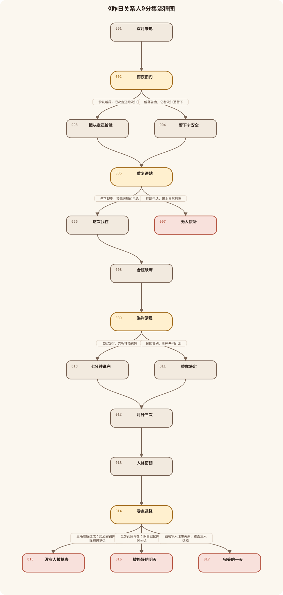
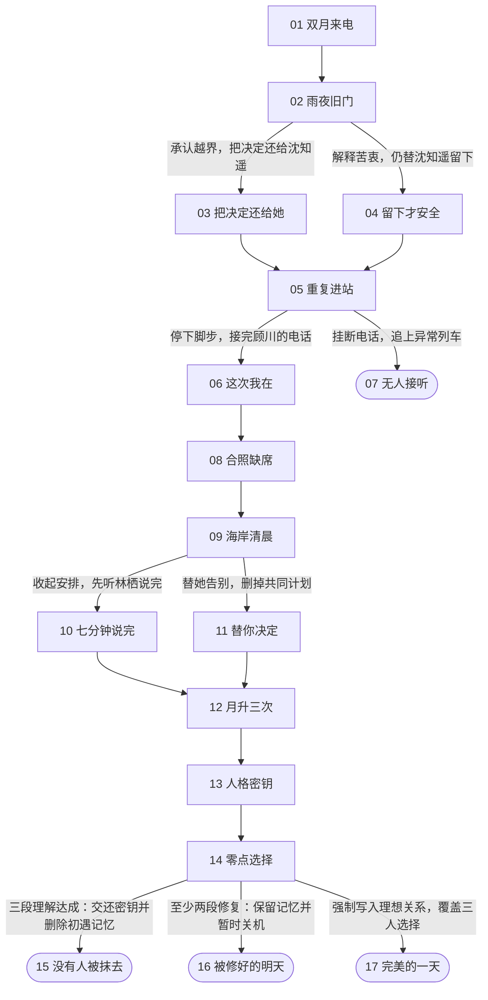

# 《昨日关系人》分集结构

查看 Mermaid 源码

## 第1集《双月来电》

2037 年的旧公寓里，沈砚拒接妹妹来电，亲眼看见月亮第二次升起；研究所警报与裂纹怀表同时启动。

## 第2集《雨夜旧门》

怀表把沈砚送回兄妹决裂的雨夜；沈知遥发现哥哥替自己拒绝外地项目，要求他停止替她决定。

选择问题：当年的外地项目，要替妹妹改成哪一种过去？

- 承认越界，把决定还给沈知遥 → 第3集
- 解释苦衷，仍替沈知遥留下 → 第4集

## 第3集《把决定还给她》

沈砚承认越界并交出电脑；沈知遥自行决定延后一年，而不是按哥哥预设的去留。

## 第4集《留下才安全》

沈砚仍以母亲离世和安全为由留下妹妹；沈知遥看穿他的控制，亲手砸断旧手机的家庭共享。

## 第5集《重复进站》

沈砚回到现实，城市地图多出一条街；他在重复进站的地铁里收到顾川十六年前的求助电话。

选择问题：顾川的求助和异常列车同时出现，沈砚先回应哪一个？

- 停下脚步，接完顾川的电话 → 第6集
- 挂断电话，追上异常列车 → 第7集

## 第6集《这次我在》

沈砚留在站台回应顾川，回到毕业日陪他停掉失控模型；顾川第一次把真正的害怕说出口。

## 第7集《无人接听》

沈砚再次挂断求助去追异常，关系锚点不足，零点重置提前启动，所有来电姓名同时消失。

## 第8集《合照缺席》

沈砚回到改变后的现实，合照恢复顾川却失去林栖；顾川主动发来坐标，指出第三组密钥在海岸。

## 第9集《海岸清晨》

沈砚回到与林栖分手的海岸清晨；林栖揭穿他所谓不拖累，其实是替她决定未来。

选择问题：林栖要离开澜城时，沈砚怎样面对她的决定？

- 收起安排，先听林栖说完 → 第10集
- 替她告别，删掉共同计划 → 第11集

## 第10集《七分钟说完》

沈砚收起调离申请，让林栖完整说出她要去海站追踪月升异常；两人约定各自选择、共同承担。

## 第11集《替你决定》

沈砚删掉共同计划并替林栖完成告别；林栖留下日志，却不再把人生交给他参与。

## 第12集《月升三次》

现实中月亮第三次升起，三人留下的协议、模型与日志同时在合照上显形，证明他们不是情感支线，而是主动密钥创造者。

## 第13集《人格密钥》

众人在研究所主控厅对质贺兰舟，得知零点重置会删除所有不稳定关系；三组人格密钥原本被设计成授权锁。

## 第14集《零点选择》

观测塔进入归零，三人分别控制自己的密钥；玩家决定删除初遇记忆、保留记忆暂时关机，或强制覆盖三人的选择。

选择问题：零点归零前，沈砚愿意把什么交还给别人？

- 三段理解达成：交还密钥并删除初遇记忆 → 第15集
- 至少两段修复：保留记忆并暂时关机 → 第16集
- 强制写入理想关系，覆盖三人选择 → 第17集

## 第15集《没有人被抹去》

沈砚在三人自主确认后删除与林栖初遇的记忆，怀表熄灭，零点重置永久关闭；世界获救，林栖成为熟悉的陌生人。

## 第16集《被修好的明天》

众人保留沈砚与林栖的记忆，合力暂时关闭装置；城市恢复，但地图上的昨日路与偶发重复广播仍然存在。

## 第17集《完美的一天》

沈砚强制把三段关系写成理想状态，主控厅与旧公寓叠合成完美一天；所有人说着正确的话，却永远重复。
